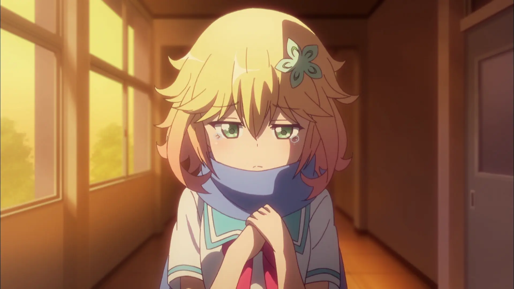

<p align="center">
 
 <h1 align="center">Omniversify</h1>
 <h3 align="center">Lightweight multi-language, multi-purpose bot for Discord</h3>
</p>

<p align="center">
 <a href="#overview">Overview</a>,
 <a href="#invite">Invite</a>,
 <a href="#host">Host</a>
</p>

## Overview

Omniversify is a Discord bot, made in TypeScript and Deno (using
[harmony](https://github.com/harmonyland/harmony) as a library).

Project is named after Omniversify Sugarbell Chisaki from Gabriel DropOut manga.

## Invite

You can invite the bot by [this link](https://Omniversify.tapni.su/invite).

This bot uses slash commands.

You can change language by using /setlangauge command.

## Host

1. Create bot -
   [Discord developer portal](https://discord.com/developers/applications). Copy
   token for bot (don't share it with anyone).

2. Install [Deno](https://deno.land/manual/getting_started/installation).

3. Clone repo:

   ```sh
   git clone https://github.com/phaylali/Omniversify-bot.git && cd ./Omniversify-bot/
   ```

4. Set environment variables (dotenv is supported), if dotenv is not used, set MODE to DEPLOY (example in [.env.sample](.env.sample)).

5. Run `deno task start`.

6. Congratulations! Now your bot is running!
